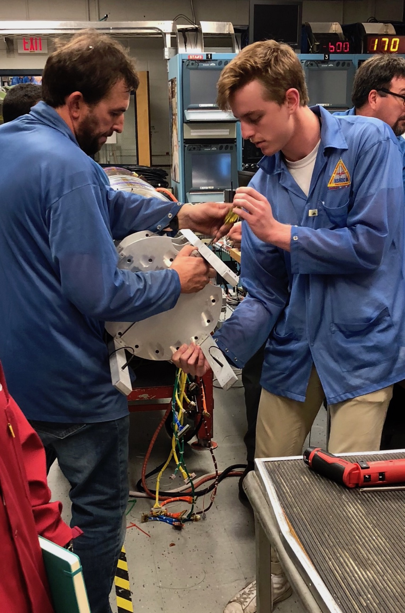

I am an aspiring aerospace engineer, and have been as long as I can remember.  I am a senior Engineering Honors student at the University of Colorado Boulder, working on my BS/MS in Aerospace Engineering Sciences, with a focus in Astrodynamics and Satellite Navigation Systems and a minor in Computer Science. 

Currently, I am working as a Research Assistant at the Colorado Center for Astrodynamics Research, developing software to detect and mitigate GNSS signal interference.

This summer, I will be interning at the Jet Propulsion Laboratory in the Flight System Systems Engineering group.

In my free time, I enjoy skiing, camping, backpacking, rock climbing, and making music.
