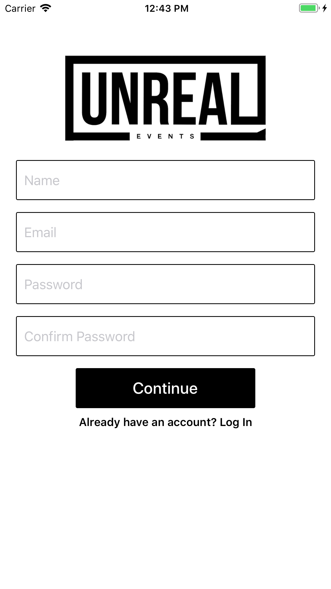
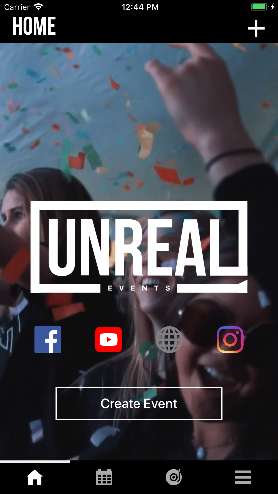
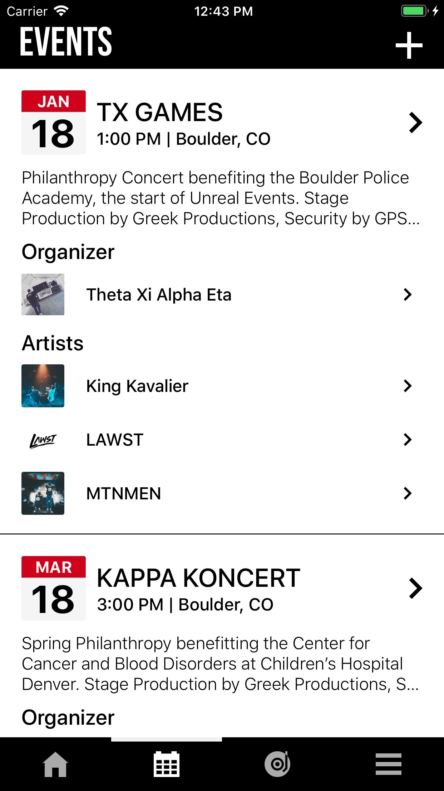
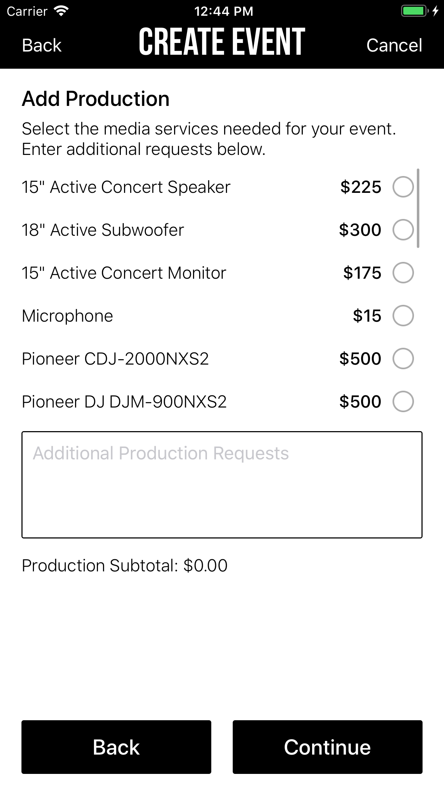

# Projects

## Unreal Events: Co-Founder/App Developer (Spring 2018)

Unreal Events was a startup to facilitate event creation and planning, an idea of a friend that we developed into a thriving business. For the launch of the startup, I developed an iOS application allowing organizers to choose artists, production, security, and a media team for their event, to pay for the event using an integrated point of sale system, and to find other local events in the area. The app was eventually discontinued as the goals and scope of the business shifted, after which I ended my association with the business. However, the startup gave me a great deal of experience with entrepreneurship, app development, and database management.

 

   

 
