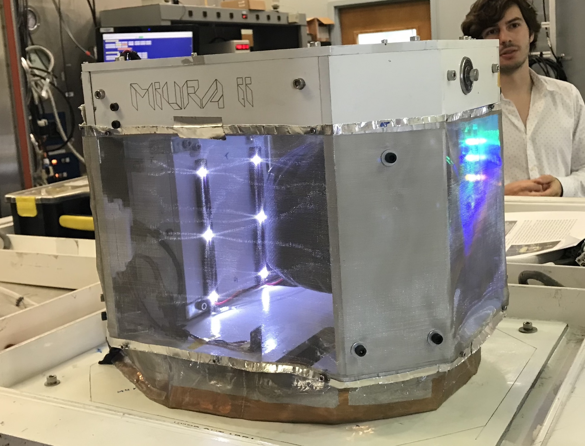

# Projects

## RocketSat 12: Avionics Engineer

 RocketSat 12 was a project through the Colorado Space Grant Consortium, contributing a payload to NASA’s 2018 RockSat-X sounding rocket. This project's objective was to receive and process RF signals from a local Doppler Nexrad station in order to determine the signal VCP and the payload's radial velocity relative to the station using doppler shift. I joined the project a few month before launch, and worked on the Avionics team from May 2018 until September 2018. The project was used Python 3 and Linux running off of a Raspberry Pi 3, and made use of a HackRF One Software Defined Radio peripheral to receive signals. While working on the Avionics team, I was responsible for fixing faulty components of the Avionics subsystem and debugging the system's malfunctioning software. I wrote a majority of the system's final code, and made integral contributions to the subsystem to prepare the project for flight. The project failed to determine the payload radial velocity due to resolution constraints from available hardware, but successfully characterized the nearby signal VCP.

    

****  

## Miura II: Flight Software Team

 Miura II was also a project through the Colorado Space Grant Consortium, contributing a payload to NASA’s 2018 High Altitude Student Platform. This project tested the pressurized deployment of a soft-shell, insulated, expandable structure in a near-space environment. This project was the second iteration of a previous project researching an expandable structure deployed using the Miura-Ori folding method. his project also used a Raspberry Pi running Linux and was written almost entirely in Python 3. I joined this project during the proposal phase during November 2017 and worked on it until flight in September 2018. While on the Flight Software team, I contributed to the full design phase of the project, including the project proposal and several design reviews. I wrote a majority of the project's flight software, which operated a motor, several solenoid valves, and heaters for the system, included serial communication with a ground station to allow command based operation of the payload, and included a series of emergency protocol in the case of hardware failure during the pressurization of the payload.

## Project Threat Level Midnight: Team Co-Lead/Software Lead

This project was for the ASEN 1400 Gateway to Space course at CU Boulder, and was my first experience working on an aerospace related project. The project researched the viability of water as a shield against dangerous particle and electromagnetic radiation found in space and near space. Our team designed, built, launched, and recovered a high-altitude balloon satellite with an integrated Arduino Uno microcontroller and an analog sensor package. As team co-lead, I helped coordinate team member responsibilities a prepare the project proposal, design reviews, and final report. As Software Lead, I wrote the project's flight software in C, which operated two geiger counters and several environmental sensors. The projet found water to be highly effective against alpha and beta type particle radiation, without harmful secondary radiation associated with metallic shielding methods, and won first place in the ITLL Fall 2016 Design Fair.

## Unreal Events: App Developer

Unreal Events was a startup to facilitate event creation and planning, an idea of a friend that we developed into a thriving business. For the launch of the startup, I developed an iOS application allowing organizers to choose artists, production, security, and a media team for their event, to pay for the event using an integrated point of sale system, and to find other local events in the area. The app was eventually discontinued as the goals and scope of the business shifted, after which I ended my association with the business. However, the startup gave me a great deal of experience with entrepreneurship, app development, and database management.
