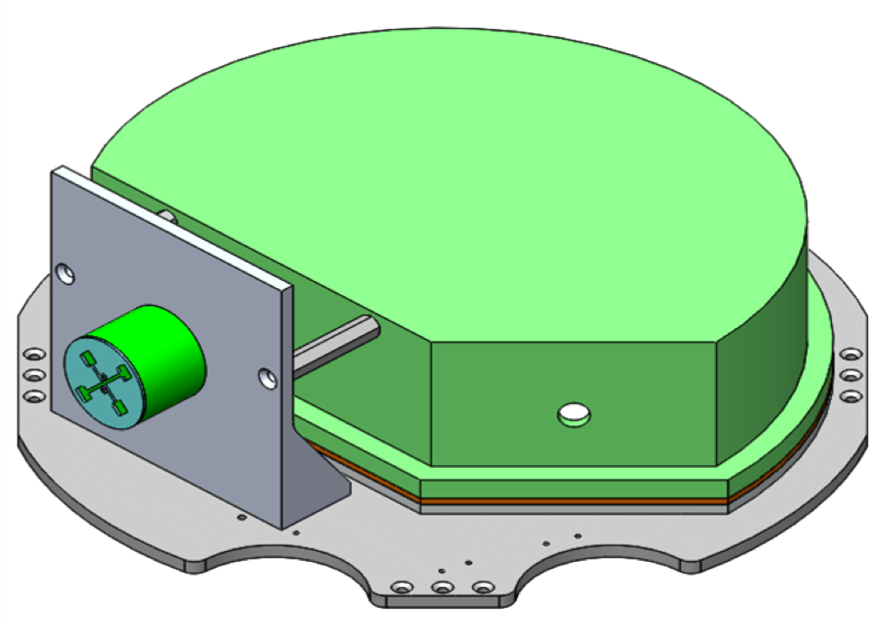
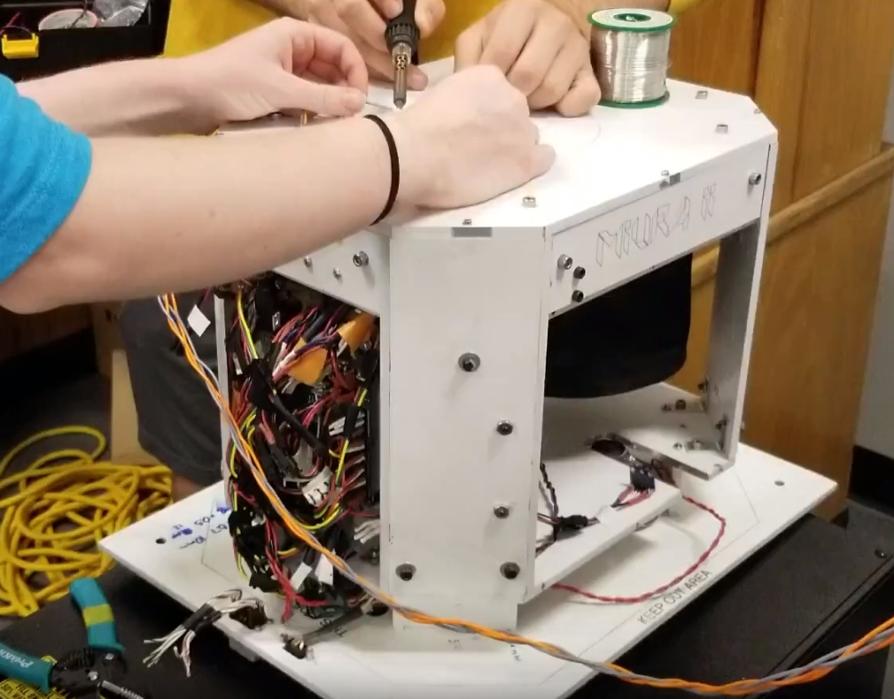

# Research

<!---
Present any research work you have done--for a class, in someone's lab, during an REU or an internship.  Include pictures, video, powerpoint presentations, visuals, etc. where relevant. This section will be especially interesting to grad schools, employers, potential research advisors (at REUs, etc.).
-->

## GNSS Interference Localization Software (Summer 2019)

Currently, I am working as a Research Assistant at the Colorado Center for Astrodynamic Research. My main focus in this position is the development of software to detect, localize, and characterize GPS/GNSS jammers and spoofers, making use of power and time difference of arrival combined with non-linear least squares estimation. Using GNSS data collected from a variety of receivers, the software works to find the location of an interfering RF transmitter and communicate this position solution to a user. Eventually, with a scaled receiver network, this system could help prevent GPS interference and spoofing across the nation, particularly in areas sensitive to GPS interference like airports and banks.

****

## RocketSat 12: Avionics Engineer (Summer 2018)

 RocketSat 12 was a project through the Colorado Space Grant Consortium, contributing a payload to NASA’s 2018 RockSat-X sounding rocket. This project's objective was to receive and process RF signals from a local Doppler Nexrad station in order to determine the signal VCP and the payload's radial velocity relative to the station using doppler shift. I joined the project a few month before launch, and worked on the Avionics team from May 2018 until September 2018. The project used Python 3 and Linux running off of a Raspberry Pi 3, and made use of a HackRF One Software Defined Radio peripheral to receive signals. While working on the Avionics team, I was responsible for fixing faulty components of the Avionics subsystem and debugging the system's malfunctioning software. I wrote a majority of the system's final code, and made integral contributions to the subsystem to prepare the project for flight. Due to resolution constraints, the project failed to determine the payload radial velocity  from available hardware, but did successfully characterized the nearby signal VCP.

 

  

 

****

## Miura II: Flight Software Team (Summer 2018)

 Miura II was also a project through the Colorado Space Grant Consortium, contributing a payload to NASA’s 2018 High Altitude Student Platform. This project tested the pressurized deployment of a soft-shell, insulated, expandable structure in a near-space environment. This project was the second iteration of a previous project researching an expandable structure deployed using the Miura-Ori folding method. his project also used a Raspberry Pi running Linux and was written almost entirely in Python 3. I joined this project during the proposal phase during November 2017 and worked on it until flight in September 2018. While on the Flight Software team, I contributed to the full design phase of the project, including the project proposal and several design reviews. I wrote a majority of the project's flight software, which operated a motor, several solenoid valves, and heaters for the system, included serial communication with a ground station to allow command based operation of the payload, and included a series of emergency protocol in the case of hardware failure during the pressurization of the payload.

 

  

 

****

## Project TLM: Team Co-Lead/Software Lead (Fall 2016)

 Project Threat Level Midnight was for the ASEN 1400 Gateway to Space course at CU Boulder, and was my first experience working on an aerospace related project. The project researched the viability of water as a shield against dangerous particle and electromagnetic radiation found in space and near space. Our team designed, built, launched, and recovered a high-altitude balloon satellite with an integrated Arduino Uno microcontroller and an analog sensor package. As team co-lead, I helped coordinate team member responsibilities a prepare the project proposal, design reviews, and final report. As Software Lead, I wrote the project's flight software in C, which operated two geiger counters and several environmental sensors. The projet found water to be highly effective against alpha and beta type particle radiation, without harmful secondary radiation associated with metallic shielding methods, and won first place in the ITLL Fall 2016 Design Fair.

 

  

 
